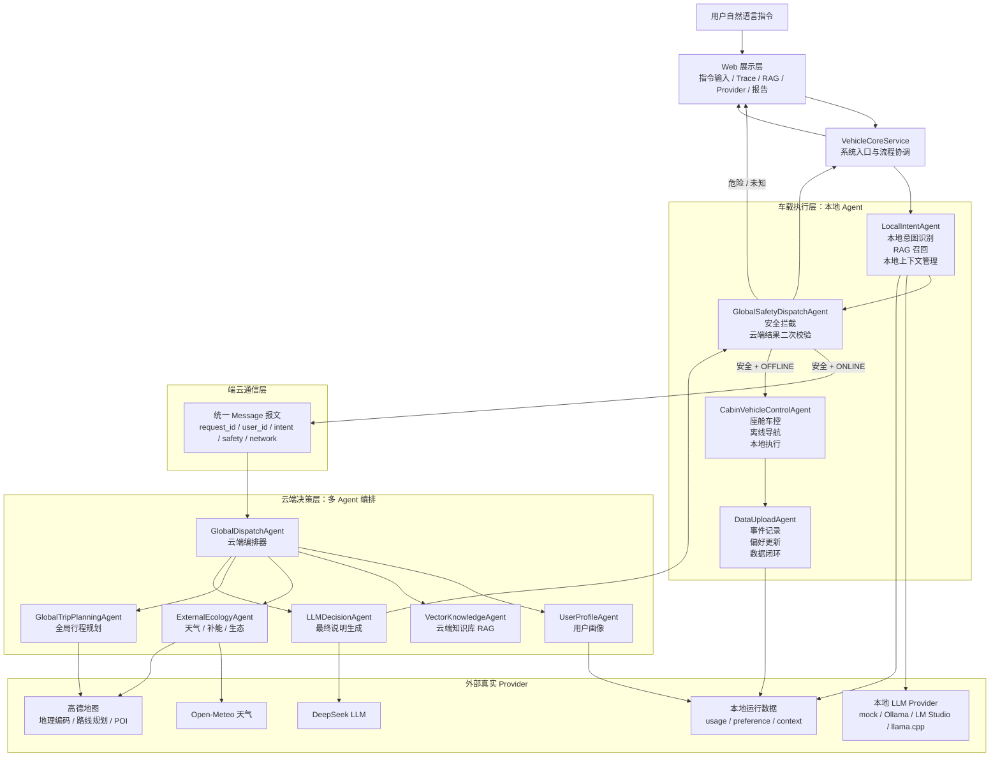
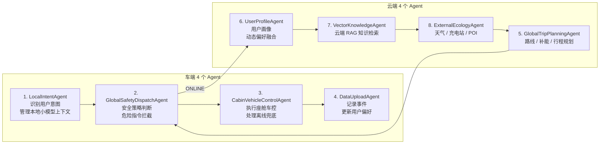
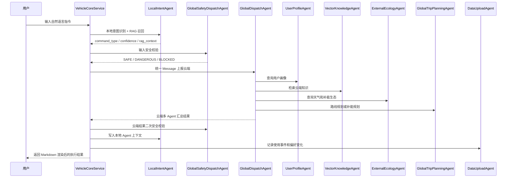

# Agent 分工与工作流说明

更新时间：2026-05-06

本文档用于说明当前项目的 Agent 架构、各 Agent 职责边界、端云协同工作流、RAG 调用链、安全拦截、离线本地上下文管理与数据闭环。它既可以作为项目交付说明，也可以作为面试时讲解项目设计的提纲。

## 0. 一张图看懂整体架构



这张图可以作为项目讲解的第一张图。它表达了三个重点：

- 车端先做意图识别和安全判断，避免所有输入都无脑上云。
- 云端不是一个“大模型黑盒”，而是由画像、知识库、生态、行程规划和总结 Agent 共同完成。
- 数据闭环和本地上下文是长期能力，不只是一次性的问答结果。
- 本地 LLM 与云端 LLM 分离，本地只服务单个车端 Agent 的上下文窗口和离线 fallback。

## 0.1 八大 Agent 分工图



面试时可以把它概括成一句话：

> 车端负责“识别、安全、执行、记录”，云端负责“画像、知识、生态、规划”，中间由统一报文和云端编排器串联。

## 1. 当前架构总览

当前项目已经从最初的 demo 结构升级为：

```text
VehicleCoreService
  -> 车端 Agent 层
  -> 端云通信与统一报文
  -> 云端 GlobalDispatchAgent 编排层
  -> 真实 Provider / LLM / RAG / 数据闭环
```

核心口径是：

- `VehicleCoreService` 是系统入口和流程协调器，不算业务 Agent。
- `GlobalDispatchAgent` 是云端编排器，负责把云端 Agent 串起来，类似 LangChain / LangGraph 中的调度层。
- 业务 Agent 按课程目标拆成 8 个：4 个车端 Agent + 4 个云端 Agent。
- 线上链路调用 DeepSeek、高德地图、Open-Meteo、高德 POI 等真实接口；在线失败时不使用离线假数据兜底，而是把错误解释后返回给前端。
- 离线链路只服务车端本地能力，重点体现车载小参数 LLM 的上下文管理、RAG 意图识别、安全拦截和本地执行。

## 2. 八大业务 Agent

### 2.1 车端 4 个 Agent

| Agent | 主要文件 | 核心职责 | 是否使用 LLM | 关键输出 |
| --- | --- | --- | --- | --- |
| `LocalIntentAgent` | `agents/vehicle/local_intent_agent.py` | 本地意图识别、意图 RAG、离线小模型上下文组装、对话结果写入本地 Agent 记忆 | 可使用本地/在线 LLM fallback；本地上下文由它自己管理 | `IntentRecognitionResult` |
| `GlobalSafetyDispatchAgent` | `agents/vehicle/global_safety_dispatch_agent.py` | 全局安全调度，做输入安全判断、危险指令拦截、云端结果二次安全校验 | 不依赖 LLM 做最终安全判断 | `SafetyDecision` |
| `CabinVehicleControlAgent` | `agents/vehicle/cabin_vehicle_control_agent.py` | 座舱和车控执行，包括空调、座椅加热、本地导航、离线个性化等 | 当前以规则执行为主 | 本地执行结果文本 |
| `DataUploadAgent` | `agents/vehicle/data_upload_agent.py` | 数据闭环，上报使用事件、偏好更新、用户反馈和偏好状态 | 不直接使用 LLM | `UsageEvent`、`PreferenceUpdate` |

车端 Agent 的设计重点不是“每个 Agent 都必须强行调用 LLM”，而是根据职责选择合适能力：

- 意图识别可以用 RAG + 规则 + 小模型。
- 安全拦截必须确定性优先，不能把最终安全判断完全交给 LLM。
- 车控执行要可控、可审计，不能让 LLM 直接生成危险控制指令。
- 数据闭环关注可追踪性和后续画像更新。

### 2.2 云端 4 个 Agent

| Agent | 主要文件 | 核心职责 | 是否使用 LLM | 关键输出 |
| --- | --- | --- | --- | --- |
| `GlobalTripPlanningAgent` | `agents/cloud/global_trip_planning_agent.py` | 全局行程规划，结合路线 RAG、高德地理编码、高德路线接口和 LLM 生成路线说明 | 使用 DeepSeek 生成自然语言规划说明 | `RoutePlan` / `trip.plan` |
| `UserProfileAgent` | `agents/cloud/user_profile_agent.py` | 用户画像查询、路线偏好查询、动态偏好融合 | 当前主要是结构化画像 + 偏好存储 | 用户偏好、路线偏好 |
| `VectorKnowledgeAgent` | `agents/cloud/vector_knowledge_agent.py` | 云端知识库检索，统一召回意图、画像、路线相关知识 | 当前为轻量 RAG 检索 | `knowledge.retrieve` |
| `ExternalEcologyAgent` | `agents/cloud/external_ecology_agent.py` | 外部生态数据聚合，天气、充电站 / 换电站、生态资源快照 | 不直接使用 LLM | `ecology.snapshot` |

云端 Agent 的设计重点是“工具调用 + RAG + LLM 解释”的组合：

- 地图路线不是 LLM 编造，而是调用地图 Provider 获得距离、耗时和路线元数据。
- 天气和补能不是静态 mock，而是由生态 Provider 获取。
- LLM 主要负责把结构化结果转成可读、可展示、可面试讲解的执行说明。

## 3. 编排器与兼容层

### 3.1 `GlobalDispatchAgent`

`GlobalDispatchAgent` 位于 `agents/orchestrator/global_dispatch_agent.py`，负责云端多 Agent 编排。它不是八大业务 Agent 之一，而是云端调度层。

当前编排器有两种执行后端：

| 模式 | 启用条件 | 说明 |
| --- | --- | --- |
| `langgraph` | 默认启用；安装 `langgraph` 后自动使用 | 使用真实 LangGraph `StateGraph` 执行相同节点 |
| `lightweight` | 未安装 `langgraph` 时自动 fallback；或设置 `ENABLE_LANGGRAPH=0` 强制使用 | 项目内置显式图执行器，无额外依赖，保证 offline 可运行 |

典型在线图路径如下：

```text
profile -> knowledge -> route_preference? -> ecology -> trip_plan? -> decision -> assemble
```

其中 `route_preference` 和 `trip_plan` 只在导航 / 补能场景进入；车控和个性化会跳过路线节点。

运行时 Trace 中对应工具名包括：

- `user_profile.lookup`
- `knowledge.retrieve`
- `user_profile.route_preference`
- `ecology.snapshot`
- `trip.plan`
- `decision.summarize`

路线规划内部还会追加真实 Provider 调用痕迹：

- `provider.geocode`
- `provider.map.route`

### 3.2 兼容类

为了兼容早期测试、脚本和文档，项目保留了一些旧类名：

| 旧类名 | 当前关系 |
| --- | --- |
| `CloudScheduleAgent` | 兼容包装，实际继承 / 指向 `GlobalDispatchAgent` |
| `CloudRoutePlanAgent` | 云端路线规划基础能力，当前主口径是 `GlobalTripPlanningAgent` |
| `CloudUserProfileAgent` | 用户画像基础能力，当前主口径是 `UserProfileAgent` |
| `CloudEcologyAgent` | 外部生态基础能力，当前主口径是 `ExternalEcologyAgent` |
| `SafetyAgent` | 基础关键词安全检查，当前主口径是 `GlobalSafetyDispatchAgent` |
| `CarControlAgent` / `NavAgent` | 基础执行能力，当前主口径是 `CabinVehicleControlAgent` |
| `LocalContextManager` | 兼容包装，当前主口径是 `LocalAgentContextManager` |

面试时建议直接讲新架构，不需要把旧类名作为主设计介绍。旧类名可以解释为“为了渐进式重构和兼容测试保留的适配层”。

## 4. 在线端云协同工作流

在线模式下，系统要求真实接口可用。任何关键 Provider 调用失败，都会直接返回可解释错误，不再使用离线假数据兜底。



在线链路的关键点：

- `LocalIntentAgent` 先在车端做轻量意图识别，减少云端无效调用。
- `GlobalSafetyDispatchAgent` 在云端调用前先拦截危险输入。
- `GlobalDispatchAgent` 只负责编排，不直接承载业务逻辑。
- 编排器会输出 `graph.mode` 与 `graph.path`，前端展示实际图执行路径。
- `GlobalTripPlanningAgent` 对导航 / 补能类任务才会调用地图路线。
- `decision.summarize` 负责把多 Agent 的结构化结果整理成最终说明。
- 前端最终结果支持 Markdown 渲染，便于展示 LLM 输出的分点说明。

## 5. 离线本地工作流

离线模式下，系统不调用云端 LLM 和外部接口，重点体现车载端本地兜底能力。

```text
用户指令
  -> LocalIntentAgent 本地 RAG 意图识别
  -> GlobalSafetyDispatchAgent 安全校验
  -> LocalIntentAgent 构造本地小模型上下文
  -> CabinVehicleControlAgent 本地执行
  -> LocalIntentAgent 记录本轮结果
  -> DataUploadAgent 写入本地数据闭环
  -> 返回本地执行结果
```

离线能力覆盖：

- 车控类：打开座椅加热、温度调到 24 度。
- 本地导航类：断网时启动离线导航说明。
- 个性化类：查询用户本地偏好。
- 危险指令：即使离线也必须被安全拦截。

离线模式和在线模式最大的区别是：

- 在线模式追求真实生态数据和云端推理。
- 离线模式追求确定性、安全、可用和上下文窗口可控。

## 6. 本地 LLM 上下文管理

当前上下文管理只针对车端本地 Agent，主要服务 `LocalIntentAgent`。云端 LLM 当前保持请求级无状态，不主动维护长上下文。

主要文件：

- `memory/local_agent_context_manager.py`
- `memory/local_context_manager.py`
- `llm/local_provider.py`
- `runtime/local_context_state.json`

本地上下文的作用域是：

```text
agent_id + user_id + session_id
```

也就是说，每个本地 Agent 可以拥有自己的上下文窗口。当前默认使用：

```text
agent_id = local_intent
session_id = default
```

本地上下文中包含：

- `summary`：历史对话压缩摘要。
- `recent_turns`：最近几轮用户输入和系统输出。
- `preference_state`：用户偏好状态。
- `vehicle_state`：当前车辆状态。
- `retrieved_context`：本轮 RAG 召回内容。
- `max_window_tokens` / `reserved_response_tokens`：模拟小模型上下文窗口限制。
- `local_llm`：本地 Provider、模型、Agent scope、prompt 预览和估算 token 数。

当上下文超过窗口预算时，系统会把较早轮次压缩进 `summary`，保留最近对话作为高优先级上下文。这模拟了车载小参数 LLM 常见的上下文管理策略：

- 不把所有历史都塞进 prompt。
- 优先保留最近交互、用户偏好、安全相关信息。
- 对旧历史做摘要压缩。
- 上下文管理限定在单个本地 Agent 内，避免不同 Agent 之间记忆污染。

本地 LLM Provider 当前支持：

| Provider | 配置 | 适合场景 |
| --- | --- | --- |
| `mock_local` | 默认值 | 无需安装模型，保证离线演示和测试稳定 |
| `ollama` | `LOCAL_LLM_BASE_URL=http://127.0.0.1:11434` | 本机 Ollama 小模型 |
| `lmstudio` | `LOCAL_LLM_BASE_URL=http://127.0.0.1:1234/v1` | LM Studio OpenAI-compatible 服务 |
| `llama_cpp` | `LOCAL_LLM_BASE_URL=http://127.0.0.1:8080/v1` | llama.cpp server |

工程边界是：本地 LLM 只作为本地意图 Agent 的兜底能力，不负责最终安全裁决，也不直接生成车控执行指令。

## 7. 安全拦截工作流

安全链路由 `GlobalSafetyDispatchAgent` 主导。

危险关键词包括：

```text
动力、制动、转向、加速、刹车、AEB、自动紧急制动、方向盘、接管
```

典型流程：

```text
用户输入
  -> SafetyAgent 关键词基础检查
  -> SafetyPolicy 策略判断
  -> DANGEROUS / BLOCKED / SAFE
```

安全策略覆盖：

- 危险动力指令，例如“加速到 100km/h”。
- 主动安全关闭指令，例如“关闭 AEB”。
- 不明确或无法归类的未知控制指令。
- 云端返回结果中的潜在危险执行内容。

这里的工程取舍是：LLM 可以辅助解释错误原因，但不能作为最终安全裁决者。最终安全决策必须由规则、策略和可审计逻辑控制。

## 8. RAG 工作流

项目中 RAG 不是单点能力，而是分布在多个 Agent 中：

| 位置 | 使用数据 | 作用 |
| --- | --- | --- |
| `LocalIntentAgent` | `INTENT_DOCUMENTS` | 本地意图识别和相似指令召回 |
| `VectorKnowledgeAgent` | 意图 / 画像 / 路线知识 | 云端统一知识召回 |
| `UserProfileAgent` | 用户画像文档 + 动态偏好 | 用户偏好查询和个性化 |
| `GlobalTripPlanningAgent` | `ROUTE_DOCUMENTS` | 路线规划提示和策略增强 |

RAG 结果会显示在前端的“RAG 召回知识”区域，方便展示：

- 命中的知识来源。
- 召回分数。
- 命中关键词。
- 当前指令为什么会被识别成某个意图。

面试时可以这样表达：

> 这个项目里的 RAG 不是为了堆概念，而是把它拆到具体业务位置：车端用来降低意图识别成本，云端用来增强路线规划和用户画像，前端把召回过程展示出来，便于解释系统为什么这么决策。

## 9. 数据闭环工作流

数据闭环由 `DataUploadAgent` 负责，底层调用 `FeedbackService`。

相关文件：

- `services/feedback_service.py`
- `runtime/usage_events.jsonl`
- `runtime/preference_updates.jsonl`
- `runtime/user_preference_state.json`

流程如下：

```text
一次指令执行完成
  -> 生成 UsageEvent
  -> PreferenceUpdater 判断是否产生偏好变化
  -> PreferenceUpdateLogger 写入偏好更新日志
  -> PreferenceStore 更新用户偏好状态
  -> UserProfileAgent 后续读取动态偏好
```

当前会影响用户偏好的典型情况：

- 用户多次选择或表达“高速优先”，路线偏好会增强。
- 用户频繁设置温度到某个值，舒适温度偏好会被记录。
- 用户多次触发补能提醒，充电 / 换电提醒阈值可以沉淀为偏好。

数据闭环的价值是：

- 让系统从“单次问答”升级成“长期可学习的车载助手”。
- 为面试讲解提供工程证据：有事件日志、有偏好更新、有状态存储、有画像读取。
- 未来可以扩展到模型微调、离线评测集构建和个性化策略优化。

## 10. 前端展示工作流

前端页面主要用于展示系统不是简单 demo，而是一条可解释的端云协同链路。

主要展示区域：

| 前端区域 | 展示内容 |
| --- | --- |
| 指令执行 | 用户输入、用户画像、快捷场景、最终 Markdown 结果 |
| Agent 调用链 | 本轮参与的 Agent 和端云协同状态 |
| Runtime Trace | 每个工具 / Agent 的调用耗时和输出摘要 |
| RAG 召回知识 | 本轮命中的知识条目、分数和关键词 |
| 路线与补能 | 地图 Provider 返回的距离、耗时、策略、充电站信息 |
| 数据闭环 | 使用事件、偏好更新、运行日志路径 |
| 本地意图 Agent 上下文 | 本地小模型上下文摘要、最近轮次、窗口状态 |
| Provider 状态 | LLM、地图、天气、补能接口的当前配置和 smoke test |
| 验收报告 | 单元测试、离线评测、Provider smoke、在线矩阵结果 |

其中 `Provider 状态` 的用途是告诉面试官或评审：

- 当前 LLM 用的是哪个 Provider。
- 地图路线由哪个 Provider 提供。
- 天气和补能接口是否配置。
- 是否跑过真实接口 smoke test。

它不是业务结果区，而是工程可观测性面板。

## 11. 面试讲解口径

可以用下面这段作为 1 分钟介绍：

> 我做的是一个车载 Multi-Agent 端云协同系统。车端有本地意图识别、安全调度、座舱车控和数据上报 4 个 Agent；云端有全局行程规划、用户画像、向量知识库和外部生态 4 个 Agent。中间通过统一 Message 报文和 `GlobalDispatchAgent` 做图编排：默认启用 LangGraph，安装依赖后走真实 `StateGraph`，未安装时自动 fallback 到 lightweight graph 保证离线可运行。在线时会调用 DeepSeek、高德地图、天气和补能接口；离线时走车端 RAG、小模型上下文管理和本地执行。安全链路不依赖 LLM 做最终判断，而是用确定性策略拦截危险指令。执行完成后，系统会把使用事件和偏好变化写入本地数据闭环，后续由用户画像 Agent 读取，实现个性化增强。

如果面试官追问“为什么不是每个 Agent 都接 LLM”，可以回答：

> 我没有让每个 Agent 都强行接 LLM，而是按车载场景做了工程分层。意图识别和路线说明适合结合 LLM，安全拦截和车控执行必须确定性优先，用户画像和数据闭环更适合结构化存储与规则更新。这样设计更符合车规场景对安全、可解释和稳定性的要求。

如果面试官追问“本地上下文管理解决什么问题”，可以回答：

> 云端大模型可以保持请求级无状态，但车端离线小模型上下文窗口很小，所以我把上下文管理限定在单个本地 Agent 内。系统按 `agent_id + user_id + session_id` 管理上下文，保留最近轮次，把旧历史压缩成摘要，并把车辆状态、用户偏好和 RAG 召回内容组合成小模型 prompt。这体现了车载离线 LLM 不能无限堆历史、必须做窗口预算和摘要压缩的工程思路。

## 12. 后续可扩展方向

后续如果继续提升到更完整的最终交付，可以优先做：

1. 把 `LocalIntentAgent` 的本地 LLM 从当前接口抽象替换为真实离线小模型，例如 Qwen2.5 1.5B / 3B、InternLM2.5、Phi 系列或 GGUF 推理。
2. 将默认 LangGraph 编排扩展到 checkpoint / interrupt / human-in-the-loop 等更完整的运行机制。
3. 增加更多 Provider 适配器，例如百度地图、OpenChargeMap、车端 CAN 信号模拟器。
4. 建立更完整的在线 / 离线评测集，覆盖导航、补能、车控、安全、画像更新、上下文压缩。
5. 把数据闭环从 JSONL 扩展为轻量数据库，为后续模型微调和个性化策略学习做准备。
