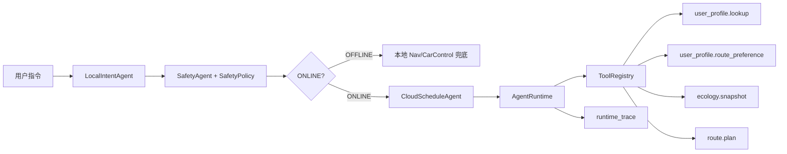

# Agent Runtime 与 Tool Registry 设计说明

## 这一步解决什么问题

上一版项目已经具备 8 个 Agent、RAG、端云协同、安全拦截和数据闭环，但云端调度还是由 `CloudScheduleAgent` 直接按顺序调用具体 Agent 方法。

这次升级把云端能力抽象成 Tool，并引入 `AgentRuntime` 统一执行 Tool、记录输入输出和耗时。这样项目从“几个类串起来的 demo”进一步接近真实 AI 应用里的 LangChain Tool、Function Calling 和 Agent Trace 思路。

## 新增模块

- `runtime/tool_registry.py`
  - 负责注册工具名与 handler。
  - 对外提供 `register()`、`call()`、`list_names()`。
  - 面试表达：这是工具能力发现与调用入口，后续真实 API 可以替换 mock handler。

- `runtime/agent_runtime.py`
  - 负责执行 Tool 调用。
  - 每次调用记录 `tool_name`、`input`、`output`、`duration_ms`。
  - 面试表达：这是可观测性和可回放能力的基础。

- `CloudScheduleAgent`
  - 不再直接调用所有云端 Agent 方法。
  - 默认注册 4 个云端 Tool：
    - `user_profile.lookup`
    - `user_profile.route_preference`
    - `ecology.snapshot`
    - `route.plan`
  - 调度时通过 `AgentRuntime.call_tool()` 执行。

## 请求链路

## 网页展示变化

Web API 新增 `runtime_trace` 字段，页面会展示每个 Tool 的名称、输出和耗时。

这让演示不只是“最终答案是什么”，还可以说明：

- 哪个 Agent 触发了工具调用。
- 每个工具输入输出是什么。
- 云端调度链路是否符合预期。
- 后续排查问题时能不能回放调用过程。

## 面试讲法

可以这样讲：

> 我一开始没有直接接大模型或 LangChain，因为项目目标是 offline 可运行。我先把 Agent 编排里的关键工程抽象做出来：Tool Registry 管能力注册，Agent Runtime 管调用执行和 trace 记录。这样即使现在是 mock API，后续接 Open-Meteo、OpenChargeMap 或大模型 Function Calling，只需要替换 Tool handler，不需要重写业务主链路。

## 后续可扩展点

1. 给 Tool 增加 schema 校验，明确每个工具的输入输出协议。
2. 给 Runtime 增加异常捕获和降级策略，例如 Tool 失败后自动走 mock provider。
3. 把 `runtime_trace` 写入数据闭环日志，用于离线评测和问题回放。
4. 接入真实 API 时保留 `MockProvider / RealProvider` 双实现，保证无网环境仍可演示。
