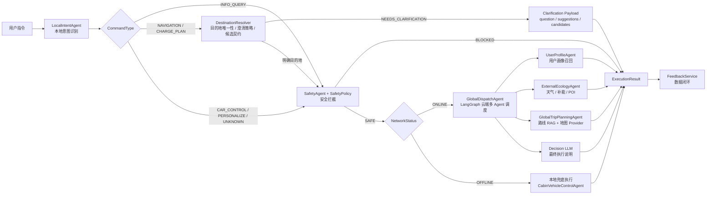
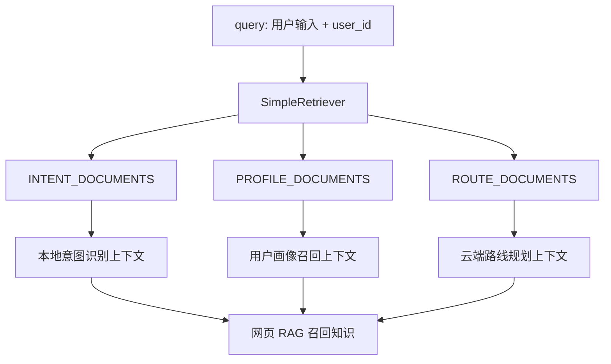
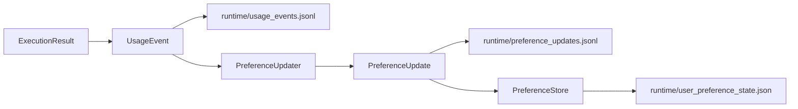
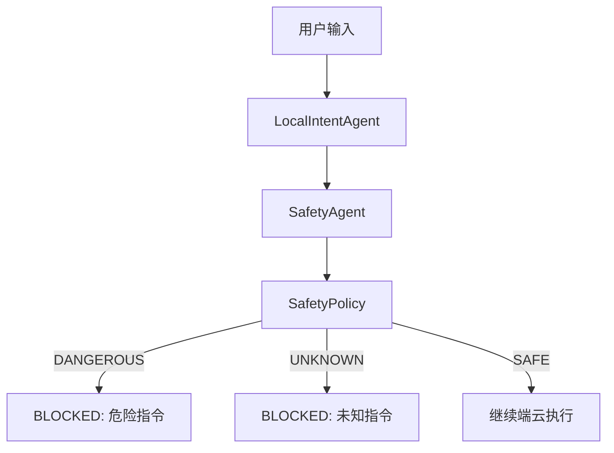

# 架构图与链路图

## 1. 端云协同主链路

```mermaid
flowchart LR
    A["用户指令"] --> B["LocalIntentAgent<br/>本地意图识别"]
    B --> B1{"CommandType"}
    B1 -->|INFO_QUERY| C["SafetyAgent + SafetyPolicy<br/>安全拦截"]
    B1 -->|NAVIGATION / CHARGE_PLAN| R["DestinationResolver<br/>目的地唯一性 / 澄清策略 / 候选契约"]
    R -->|NEEDS_CLARIFICATION| Q["Clarification Payload<br/>question / suggestions / candidates"]
    R -->|明确目的地| C
    B1 -->|CAR_CONTROL / PERSONALIZE / UNKNOWN| C
    C -->|BLOCKED| J["ExecutionResult"]
    C -->|SAFE| D{"NetworkStatus"}
    D -->|ONLINE| E["GlobalDispatchAgent<br/>LangGraph 云端多 Agent 调度"]
    D -->|OFFLINE| F["本地兜底执行<br/>CabinVehicleControlAgent"]
    E --> G["UserProfileAgent<br/>用户画像召回"]
    E --> H["ExternalEcologyAgent<br/>天气 / 补能 / POI"]
    E --> I["GlobalTripPlanningAgent<br/>路线 RAG + 地图 Provider"]
    E --> L["Decision LLM<br/>最终执行说明"]
    G --> J
    H --> J
    I --> J
    L --> J
    Q --> J
    F --> J
    J --> K["FeedbackService<br/>数据闭环"]
```

## 2. RAG 召回链路

```mermaid
flowchart TD
    A["query: 用户输入 + user_id"] --> B["SimpleRetriever"]
    B --> C["INTENT_DOCUMENTS"]
    B --> D["PROFILE_DOCUMENTS"]
    B --> E["ROUTE_DOCUMENTS"]
    C --> F["本地意图识别上下文"]
    D --> G["用户画像召回上下文"]
    E --> H["云端路线规划上下文"]
    F --> I["网页 RAG 召回知识"]
    G --> I
    H --> I
```

## 3. 数据闭环链路

```mermaid
flowchart LR
    A["ExecutionResult"] --> B["UsageEvent"]
    B --> C["runtime/usage_events.jsonl"]
    B --> D["PreferenceUpdater"]
    D --> E["PreferenceUpdate"]
    E --> F["runtime/preference_updates.jsonl"]
    E --> G["PreferenceStore"]
    G --> H["runtime/user_preference_state.json"]
```

## 4. 安全策略链路

```mermaid
flowchart TD
    A["用户输入"] --> B["LocalIntentAgent"]
    B --> C["SafetyAgent"]
    C --> D["SafetyPolicy"]
    D -->|DANGEROUS| E["BLOCKED: 危险指令"]
    D -->|UNKNOWN| F["BLOCKED: 未知指令"]
    D -->|SAFE| G["继续端云执行"]
```
