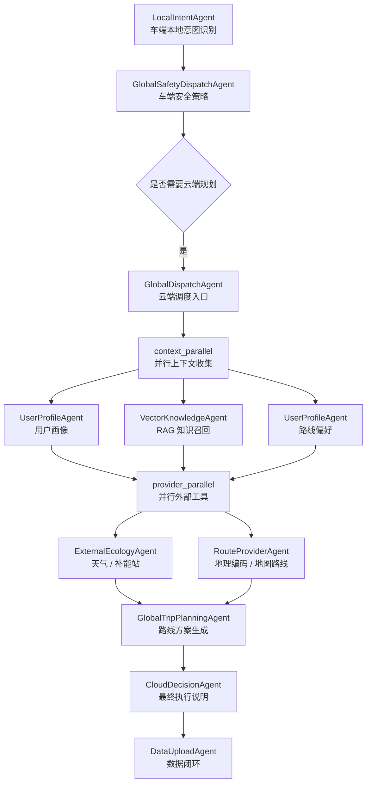

# 云端路线工具并行化改造记录

日期：2026-05-11

## 1. 改造背景

在上一版云端链路中，导航类任务的执行顺序大致是：

```text
用户画像 / 知识库 / 路线偏好 / 外部生态 -> GlobalTripPlanningAgent -> CloudDecisionAgent
```

其中 `ExternalEcologyAgent` 会获取天气、补能站等生态信息；`GlobalTripPlanningAgent` 内部又会执行地理编码、地图路线查询和最终路线方案生成。

用户在前端观察 Agent 链路时提出两个问题：

- `ExternalEcologyAgent` 和路线相关工具看起来像可以并行，为什么要串行展示？
- 如果把 `ExternalEcologyAgent` 和 `GlobalTripPlanningAgent` 直接并行，会不会反而让总耗时变长？

这次改造的核心判断是：

**不能把整个 `GlobalTripPlanningAgent` 和 `ExternalEcologyAgent` 粗暴并行，因为最终路线生成依赖生态、地图、偏好等上下文；但可以把路线规划前置的外部 IO 工具拆出来，与生态数据采集并行。**

## 2. 设计原则

### 2.1 只并行独立 IO，不增加 LLM 调用

本次没有增加新的 LLM 决策节点。

并行化只发生在外部工具调用阶段：

- 天气 / 补能站生态数据
- 地理编码
- 地图路线查询

最终路线说明仍然由 `GlobalTripPlanningAgent` 统一生成，避免多个 LLM 同时生成相互冲突的出行建议。

### 2.2 保持业务依赖顺序清晰

新的依赖关系是：

```text
context_parallel
  -> provider_parallel
  -> trip_plan
  -> decision
  -> assemble
```

其中：

- `context_parallel`：并行收集用户画像、知识库召回、路线偏好。
- `provider_parallel`：并行获取外部生态和路线工具结果。
- `trip_plan`：基于前面所有上下文生成路线方案。
- `decision`：生成云端最终执行说明。
- `assemble`：组装最终返回结果和可观测信息。

## 3. 改造后的链路



## 4. 代码改动

### 4.1 拆分路线工具上下文

文件：`agents/cloud/cloud_route_plan_agent.py`

新增 `build_route_context()`：

- 负责 RAG 路线提示召回。
- 负责目的地解析。
- 负责地图路线查询。
- 返回 `route_context`，供后续 `trip.plan` 使用。

调整 `plan()`：

- 支持传入已有 `route_context`。
- 如果已有 `route_context`，不再重复调用地理编码和地图路线工具。
- 只负责最终路线建议生成。

这样实现后，地图 IO 可以被前置并行，最终 LLM 生成仍然保持单点收敛。

### 4.2 增加云端第二段并行节点

文件：`agents/orchestrator/global_dispatch_agent.py`

新增 `_graph_provider_parallel()`：

- 并行调用 `ecology.snapshot` 和 `route.context`。
- 将生态结果写入 `ecology_snapshot`。
- 将路线工具结果写入 `route_context`。
- 将地理编码和地图路线 trace 继续写入 runtime trace。

新增工具：

- `route.context`
- `ecology.snapshot` 支持传入 GPS

### 4.3 更新 LangGraph 工作流

文件：`workflow/cloud_graph.py`

新增节点：

- `context_parallel`
- `provider_parallel`

导航 / 补能类任务的新图路径：

```text
context_parallel -> provider_parallel -> trip_plan -> decision -> assemble
```

非路线规划类任务仍然可以跳过路线工具，直接进入决策或本地执行链路。

### 4.4 前端观测同步

文件：

- `web_demo/app_model.py`
- `web_demo/static/js/renderers/trace.js`

前端新增展示：

- `RouteProviderAgent`
- `provider_parallel` 并行阶段
- `provider.geocode`
- `provider.map.route`

工具归属关系调整为：

```text
ExternalEcologyAgent -> ecology.snapshot
RouteProviderAgent -> provider.geocode / provider.map.route
GlobalTripPlanningAgent -> trip.plan
CloudDecisionAgent -> decision.summarize
```

这样前端看到的链路更接近真实工程中的职责边界：生态数据、地图工具、路线方案生成不再混在一个 Agent 输出里。

## 5. 为什么不让两个 Agent 整体并行

`ExternalEcologyAgent` 和 `GlobalTripPlanningAgent` 表面上看像两个独立 Agent，但实际依赖关系不是完全独立。

`GlobalTripPlanningAgent` 的最终输出需要综合：

- 用户画像
- 路线偏好
- RAG 知识
- 天气
- 补能站
- 地图路线

如果让它和生态 Agent 整体并行，就会出现两种问题：

1. `trip.plan` 在生态数据没返回前就开始生成，导致路线建议缺少天气和补能信息。
2. 后续还要再做一次补充合并，可能增加一次 LLM 调用，总耗时和不稳定性都会增加。

所以更合理的做法是：

**把 `GlobalTripPlanningAgent` 内部的地图 IO 拆出为 `RouteProviderAgent`，让它和生态 IO 并行；等所有工具结果返回后，再由 `GlobalTripPlanningAgent` 做一次最终方案生成。**

## 6. 性能影响

改造前，路线规划链路中的慢操作更偏串行：

```text
生态数据 -> 地理编码 -> 地图路线 -> 路线生成
```

改造后，慢 IO 分成两路并行：

```text
生态数据
      \
       -> 路线生成
      /
地理编码 + 地图路线
```

理论上总耗时接近：

```text
max(生态数据耗时, 地图工具耗时) + 路线生成耗时
```

而不是：

```text
生态数据耗时 + 地图工具耗时 + 路线生成耗时
```

前提是：

- 不额外增加 LLM 调用。
- 不让 final decision 重复生成。
- trace 写入保持确定顺序，避免前端显示混乱。

本次实现符合这个前提。

## 7. 验证结果

已完成的验证：

```text
69 passed, 2 warnings
```

重点验证点：

- LangGraph 路径包含 `context_parallel` 和 `provider_parallel`。
- `parallel_groups` 同时包含上下文并行组和路线工具并行组。
- runtime trace 顺序符合预期：

```text
user_profile.lookup
knowledge.retrieve
user_profile.route_preference
ecology.snapshot
provider.geocode
provider.map.route
trip.plan
decision.summarize
```

- 前端能够识别 `RouteProviderAgent`。
- `provider.geocode` 和 `provider.map.route` 不再归属到 `GlobalTripPlanningAgent`。
- 静态资源版本已更新，降低浏览器缓存导致前端不同步的风险。

## 8. 面试表达

可以这样讲：

> 我在云端调度链路中做了一次并行化重构。最开始路线规划、生态数据和地图工具展示上比较像串行链路，但实际工程里天气、补能站、地理编码和地图路线都属于外部 IO，彼此之间大部分可以并行。  
> 
> 我没有简单把两个 Agent 粗暴并行，因为最终路线方案依赖生态和地图结果。如果直接并行，会导致路线生成拿不到完整上下文，或者需要二次 LLM 汇总。我的做法是把 `GlobalTripPlanningAgent` 内部的地图工具拆成独立的 `RouteProviderAgent`，让它和 `ExternalEcologyAgent` 并行执行，最后再统一进入 `GlobalTripPlanningAgent` 生成最终方案。  
> 
> 这样既缩短了外部 IO 等待时间，又保持了最终决策的单点收敛，前端 trace 也能清楚展示每个 Agent 的职责和对应工具输出。

## 9. 后续可继续优化

1. 为 `provider_parallel` 增加超时策略，避免某个外部接口拖慢整条链路。
2. 为天气、补能站、地图路线分别增加缓存，减少重复演示时的接口消耗。
3. 在前端展示并行组的开始时间、结束时间和等待耗时，更直观体现并行收益。
4. 将 `route.context` 的结构化输出进一步标准化，方便后续替换真实地图 Provider。
5. 增加 `ProviderError` 分支，让某个非核心外部接口失败时可以降级，而不是整条路线规划直接失败。
