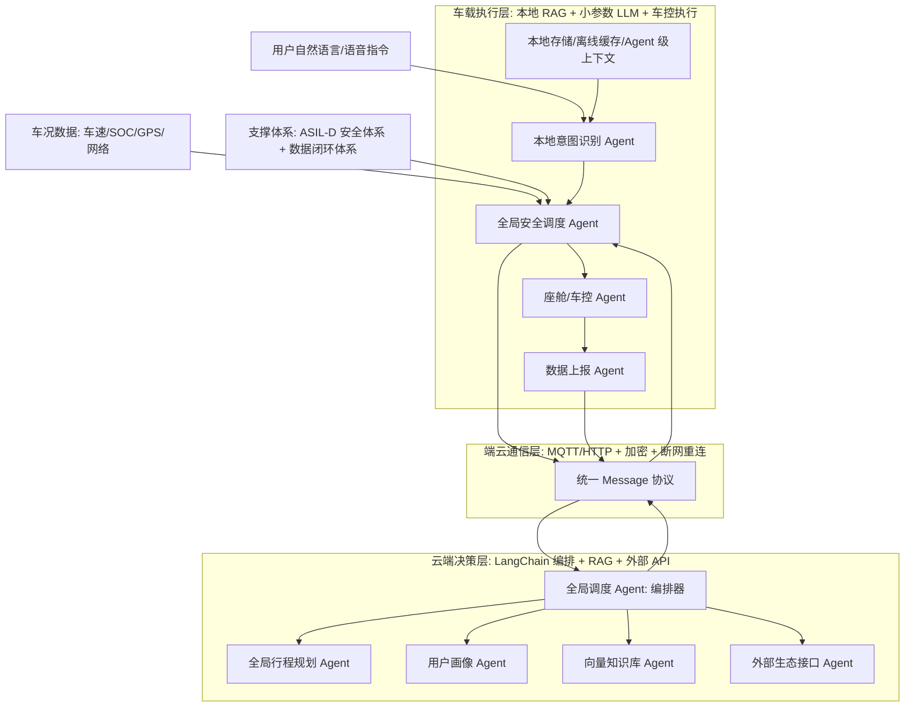

# 课程附件对齐后的项目结构梳理

更新时间：2026-05-05

## 1. 结论先行

本项目不应被理解为“写 8 个类的 demo”，而应被理解为一个面向长途出行全生命周期的车载 Multi-Agent 端云协同系统。

根据四个附件重新校准后，项目应采用以下口径：

- 八大业务 Agent 以《第1课课程作业范例（完整版）》中的角色清单为准。
- 《系统架构.pdf》中的全局调度 Agent 是编排中枢，负责 LangChain 式任务拆解和调度，不应和八大业务 Agent 混为同一层级。
- 《Session 2 Automotive_LLM_Engineering_Blueprint.pdf》强调的是工程化落地约束：本地小模型、RAG、Token 边界、量化、延迟和安全兜底。
- 《Multi-Agent_Automotive_AI_Blueprint.pptx》强调的是产品视角：四大域、全生命周期动线、跨域协同和车规级安全红线。

因此，后续代码结构应从“当前 demo 类名”升级为“业务 Agent + 编排器 + 端云基础设施 + 工程约束”的项目结构。

## 2. 附件口径提炼

| 附件 | 关键内容 | 对项目结构的影响 |
| --- | --- | --- |
| 第1课课程作业范例 | 蔚来长途自驾场景、AI 原生 PRD、八大 Agent、用户旅程地图、车规安全要求 | 决定八大业务 Agent 的职责边界和端云部署位置 |
| 系统架构.pdf | 支撑体系、云端决策层、端云通信层、车载执行层；云端 LangChain + RAG，车端本地 RAG + 小模型 | 决定系统分层、调用链和端云消息结构 |
| Session 2 工程化蓝图 | 端侧 Qwen-7B-Int4、Embedding、RAG chunk、FAISS、TokenControlCallback、上下文上限 | 决定本地 LLM 不能无限上下文，必须做 Agent 级上下文管理 |
| Multi-Agent 产品蓝图 | 整车四大域、Pre-trip/In-trip/Post-trip 动线、全局调度、跨域协同、数据闭环 | 决定项目不能只演示单轮指令，应覆盖全生命周期场景 |

## 3. 产品定位

项目名称建议统一为：

```text
蔚来全域智能出行 Multi-Agent 助手
```

产品定位：

```text
依托车云协同架构和 Multi-Agent 编排，为长途自驾用户提供出行规划、路线导航、补能推荐、座舱适配、安全兜底和行程复盘的一体化智能服务。
```

它的核心不是“一个聊天机器人”，而是：

- 打通导航、补能、座舱、车控、用户画像、外部生态等跨域数据。
- 从被动响应升级为主动规划。
- 车端掌握最终执行权和安全兜底权。
- 云端负责复杂决策、RAG、生态数据整合和数据闭环。

## 4. 总体架构



这里要特别注意：

- `全局调度 Agent` 是编排器，负责拆任务、排顺序、合并结果。
- `八大业务 Agent` 是真正承担业务闭环的能力单元。
- `支撑体系` 包含安全体系和数据闭环，不是一个普通业务 Agent。

## 5. 八大业务 Agent

### 5.1 统计口径说明

为了避免再混淆，本项目后续以“八大业务 Agent + 一个编排器”的方式组织。

八大业务 Agent 来自第1课作业范例的完整清单：

1. 全局行程规划 Agent
2. 用户画像 Agent
3. 向量知识库 Agent
4. 外部生态接口 Agent
5. 全局安全调度 Agent
6. 本地意图识别 Agent
7. 座舱/车控 Agent
8. 数据上报 Agent

另外，系统架构图中的 `全局调度 Agent` 是云端编排器。它可以在代码里实现为一个类，但文档表达上不把它算进八大业务 Agent，否则数量和职责会冲突。

### 5.2 职责拆分

| 序号 | Agent | 部署位置 | 核心职责 | 是否必须接 LLM |
| --- | --- | --- | --- | --- |
| 1 | 全局行程规划 Agent | 云端 | 跨城路线规划、补能点规划、行程动态调整、预计到达 SOC、路线风险提示 | 需要云端 LLM + 地图/补能/天气工具，但 LLM 不保存长期上下文 |
| 2 | 用户画像 Agent | 云端 | 管理长期偏好，如高速偏好、座舱温度、补能习惯、常用目的地 | 可选 LLM，用于偏好总结；核心应是结构化画像和向量检索 |
| 3 | 向量知识库 Agent | 云端 | 管理 RAG 知识、用户场景记忆、长时偏好检索、路线/补能知识召回 | 不一定需要生成式 LLM，核心是 Embedding + 检索 |
| 4 | 外部生态接口 Agent | 云端 | 对接天气、地图、充电/换电、POI、服务区等外部 API | 通常不需要 LLM，主要是 API 工具和数据清洗 |
| 5 | 全局安全调度 Agent | 车载端 | 指令安全校验、危险操作拦截、云端下发结果二次校验、断网安全兜底 | 最终裁决不能依赖生成式 LLM，应以确定性规则/策略为准 |
| 6 | 本地意图识别 Agent | 车载端 | 本地解析用户指令，弱网/断网时完成基础语义理解和本地 RAG 召回 | 需要本地小参数 LLM 或轻量模型，是本地上下文管理的主要对象 |
| 7 | 座舱/车控 Agent | 车载端 | 执行空调、座椅、音乐、导航加载等低风险控制动作，反馈执行状态 | 不应直接用 LLM 控硬件，只接收结构化且已过安全校验的动作 |
| 8 | 数据上报 Agent | 车载端 | 采集车况、交互日志、行程轨迹、执行结果，断网缓存并联网补发 | 不需要 LLM，重点是加密、缓存、补发和数据闭环 |

## 6. 四大域映射

PPT 中的四大域是更高一层的产品抽象，和八大 Agent 不是一一等价关系。

| 整车域 | 关注点 | 对应 Agent |
| --- | --- | --- |
| 智能驾驶域 NAD/NOP | 路径规划、智驾状态、行驶风险、路线接管 | 全局行程规划 Agent、全局安全调度 Agent |
| 智能座舱域 NOMI | 自然语言入口、座舱偏好、空间调节、交互体验 | 本地意图识别 Agent、用户画像 Agent、座舱/车控 Agent |
| 整车控制域 | 三电、车身控制、执行权限、硬件状态 | 全局安全调度 Agent、座舱/车控 Agent、数据上报 Agent |
| 出行服务生态 | 补能网络、天气、POI、服务区、外部生活服务 | 外部生态接口 Agent、向量知识库 Agent、全局行程规划 Agent |

这也是面试时可以强调的点：Agent 不是为了“凑数量”，而是为了解决跨域数据割裂。

## 7. 典型业务链路

### 7.1 出发前规划

```text
用户说“明天去杭州”
  -> 本地意图识别 Agent 快速识别为长途出行规划
  -> 全局安全调度 Agent 做初步安全校验
  -> 端云通信层上报 Message
  -> 全局调度 Agent 拆解任务
  -> 全局行程规划 Agent 生成路线
  -> 用户画像 Agent 提供路线/座舱/补能偏好
  -> 向量知识库 Agent 召回长途出行知识和历史场景记忆
  -> 外部生态接口 Agent 查询天气、补能站、路况/POI
  -> 云端返回结构化行程方案
  -> 车端安全校验后加载导航和座舱配置
```

### 7.2 行驶途中本地车控

```text
用户说“温度调到 24 度”
  -> 本地意图识别 Agent 解析为座舱舒适指令
  -> 全局安全调度 Agent 确认不是危险控制
  -> 座舱/车控 Agent 执行空调调节
  -> 数据上报 Agent 记录本次操作
```

这类指令不应绕到地图或云端路线规划，也不应让云端 LLM 参与低风险硬件执行。

### 7.3 中途补能规划

```text
车辆 SOC 低于阈值或用户说“电量低”
  -> 本地意图识别 Agent 识别补能需求
  -> 上报车况、GPS、SOC、目的地
  -> 全局调度 Agent 调用行程规划、外部生态、用户画像、向量知识库
  -> 生成换电/充电方案、绕行成本、排队风险
  -> 车端安全校验后更新导航目标
```

### 7.4 行程结束与数据闭环

```text
行程结束
  -> 数据上报 Agent 汇总行程、能耗、补能、交互、异常
  -> 云端用户画像 Agent 更新长期偏好
  -> 向量知识库 Agent 写入场景记忆
  -> 云端生成行程复盘和下次出行建议
```

偏好更新必须有约束：危险行为不能被学习，偶发行为不能立即变成长期偏好，涉及隐私的数据要脱敏或加密。

## 8. LLM 与上下文管理口径

### 8.1 云端 LLM

云端可以有多个 LLM 调用，例如：

- 全局调度 Agent 使用云端 LLM 做任务拆解和结果整合。
- 全局行程规划 Agent 使用云端 LLM 生成路线说明。
- 用户画像 Agent 使用云端 LLM 总结偏好变化。

但云端 LLM 不主动维护多轮上下文。它每次只接收当前请求需要的结构化输入：

```text
当前用户指令
当前车况
当前 GPS / 目的地
用户画像摘要
RAG 召回片段
外部 API 结果
安全策略约束
```

这样做的原因是云端调度需要稳定、可控、可观测，不能让历史对话无限膨胀，也不能让旧上下文污染本次行驶决策。

### 8.2 本地 LLM

本地 LLM 指的是部署在车端的小参数离线模型，例如课程中提到的 Qwen-7B-Int4、ChatGLM3-6B-Int4 或更小的低算力兜底模型。

本地 LLM 的使用边界应更窄：

- 优先服务 `本地意图识别 Agent`。
- 用于断网/弱网时的语义理解、本地 RAG 召回和基础指令结构化。
- 不直接决定危险车控动作。
- 不直接控制制动、转向、动力等安全关键硬件。

### 8.3 上下文管理只属于单个本地 Agent

用户之前强调的点是正确的：本地小模型需要上下文管理，但这个管理不应该是全系统共享记忆，而应该只针对具体的本地 LLM Agent。

推荐口径：

```text
LocalIntentAgent
  -> LocalAgentContextManager(agent_id="local_intent", user_id, session_id)
  -> build_context()
  -> local LLM inference
  -> structured intent output
```

上下文隔离键：

```text
agent_id + user_id + session_id
```

如果未来另一个本地 Agent 也需要小模型，例如本地摘要 Agent 或本地座舱感知 Agent，也应该拥有自己的上下文命名空间，而不是共用 `VehicleCoreService` 的全局上下文。

### 8.4 本地上下文的内容

本地 LLM Agent 的上下文建议由这些部分组成：

1. 系统提示词和安全边界，永远不能被截断。
2. 当前用户指令。
3. 当前车况和网络状态。
4. 本地 RAG 召回片段。
5. 该 Agent 自己的最近 N 轮交互。
6. 该 Agent 自己的压缩摘要。
7. 轻量用户偏好，如“温度 24℃”“路线偏好高速”。
8. 可调用动作 schema。

### 8.5 Token 预算

课程第二课给出的工程化约束可以转成项目规则：

```text
Max tokens: 8000
Generation buffer: 500
Context limit: 7500
Embedding 输入建议不超过 512 中文字符
用户偏好注入建议控制在 50 中文字符左右
RAG 片段按相关性裁剪，低相关片段优先丢弃
```

溢出时的裁剪优先级：

1. 丢弃低相关 RAG 片段。
2. 压缩更早的历史 turn。
3. 缩短用户偏好描述。
4. 保留安全策略、当前指令、当前车况和工具 schema。

## 9. 当前代码与课程口径的差距

当前项目已经具备一个可演示的端云协同原型，但和附件口径相比，还需要重新命名和补齐边界。

| 当前模块 | 课程口径对应 | 当前问题 | 后续调整 |
| --- | --- | --- | --- |
| `agents/cloud/cloud_schedule_agent.py` | 全局调度 Agent | 它是编排器，不应算进八大业务 Agent | 保留为 orchestrator，明确职责为任务拆解、调度、合并 |
| `agents/cloud/cloud_route_plan_agent.py` | 全局行程规划 Agent | 当前偏路线结果，补能和全生命周期不足 | 扩展为路线 + 补能 + 行程阶段决策 |
| `agents/cloud/cloud_user_profile_agent.py` | 用户画像 Agent | 画像和向量知识库职责有混合 | 拆出 `VectorKnowledgeAgent` |
| `rag/` | 向量知识库 Agent 的基础设施 | 目前是检索能力，不是显式 Agent | 增加 Agent 包装，统一召回、评分、引用来源 |
| `agents/cloud/cloud_ecology_agent.py` | 外部生态接口 Agent | 已接天气、地图、POI 等方向，但命名偏 demo | 强化 API 状态、失败原因、数据来源可观测 |
| `agents/vehicle/safety_agent.py` | 全局安全调度 Agent | 已有安全拦截，但还应覆盖云端结果二次校验 | 升级为策略引擎，保留最终否决权 |
| `agents/vehicle/local_intent_agent.py` | 本地意图识别 Agent | 当前本地上下文不应挂在全局服务层 | 将上下文管理改成该 Agent 私有 |
| `agents/vehicle/car_control_agent.py` + `nav_agent.py` | 座舱/车控 Agent | 执行能力拆得偏技术，课程口径是座舱/车控统一执行层 | 作为执行适配器挂到 `CabinVehicleControlAgent` 下 |
| `feedback/`、`runtime/`、`memory/` | 数据上报 Agent + 数据闭环 | 已有数据闭环雏形，但不是 Agent 化表达 | 新增 `DataUploadAgent`，负责缓存、上报、补发、闭环事件 |

## 10. 推荐目录结构

后续可以逐步重构为以下结构：

```text
agents/
  orchestrator/
    global_dispatch_agent.py

  cloud/
    global_trip_planning_agent.py
    user_profile_agent.py
    vector_knowledge_agent.py
    external_ecology_agent.py

  edge/
    global_safety_dispatch_agent.py
    local_intent_agent.py
    cabin_vehicle_control_agent.py
    data_upload_agent.py

llm/
  cloud_llm_client.py
  local_llm_client.py
  prompt_templates.py

memory/
  local_agent_context_manager.py
  preference_store.py

rag/
  chunker.py
  retriever.py
  vector_store.py
  token_budget.py

providers/
  map_provider.py
  weather_provider.py
  charge_provider.py
  poi_provider.py

core/
  message.py
  vehicle_core_service.py
  command_router.py
  execution_result.py

safety/
  safety_policy.py
  command_guard.py
  cloud_result_guard.py

feedback/
  data_upload_queue.py
  trip_report.py
  preference_update_policy.py

web_demo/
  server.py
  app_model.py
  static/
```

## 11. 下一轮编码建议

### 第一阶段：口径修正，不大改行为

目标是让代码结构和附件口径一致。

- 增加 `VectorKnowledgeAgent`，把 RAG 检索从“工具函数”提升为显式 Agent。
- 增加 `DataUploadAgent`，把运行日志、离线缓存、用户偏好更新统一纳入数据闭环。
- 把 `CloudScheduleAgent` 文档和前端展示改为 `GlobalDispatchAgent`，明确它是编排器。
- 把当前文档中“八大 Agent”的列表改成课程口径。

### 第二阶段：本地 LLM 上下文管理重构

目标是修正当前上下文管理过宽的问题。

- 将 `LocalContextManager` 改为 `LocalAgentContextManager`。
- 增加 `agent_id`、`session_id`。
- 只在 `LocalIntentAgent` 本地 LLM 调用前组装上下文。
- 在线云端 LLM 不读取这份上下文。
- 前端展示改成“本地意图识别 Agent 上下文”，而不是“全局本地上下文”。

### 第三阶段：全生命周期场景补齐

目标是让演示从“单条指令”升级为“行程动线”。

- 出发前：长途路线 + 补能 + 天气 + 用户偏好。
- 行驶中：本地车控 + 安全拦截 + 动态路线更新。
- 中途补给：低电量触发 + 换电/充电站选择 + 导航更新。
- 抵达后：数据上报 + 偏好更新 + 行程报告。

### 第四阶段：工程化验收

目标是能在面试里讲清楚项目不是玩具 demo。

- 安全拦截命中率。
- RAG 召回命中率。
- 外部 API smoke test。
- 本地上下文压缩测试。
- 断网模式可用性测试。
- 云端失败时的错误解释。
- 前端 Agent 调用链可视化。

## 12. 面试表达建议

可以这样解释项目：

```text
我没有把 Multi-Agent 简单理解成“写 8 个类”，而是先从长途出行用户旅程拆出跨域痛点，再把痛点映射到八大业务 Agent。

云端负责复杂决策，包括行程规划、用户画像、RAG 知识库和外部生态；车端负责本地意图识别、安全兜底、座舱车控和数据上报。

全局调度 Agent 是编排器，不和八大业务 Agent 混为一个层级。它负责把一句自然语言指令拆成路线、补能、画像、生态、安全校验等子任务，再把结果合并成车端可执行的结构化指令。

LLM 不是每个 Agent 都必须接。安全和车控不能依赖生成式 LLM 做最终裁决；外部生态主要是 API 工具；向量知识库主要是 Embedding 和检索。真正需要本地上下文管理的是车端小参数 LLM 所在的本地意图识别 Agent，而且上下文应该按 agent_id、user_id、session_id 隔离。
```

这套说法能同时覆盖产品思维、Agent 架构、工程边界、车规安全和 LLM 落地约束。
