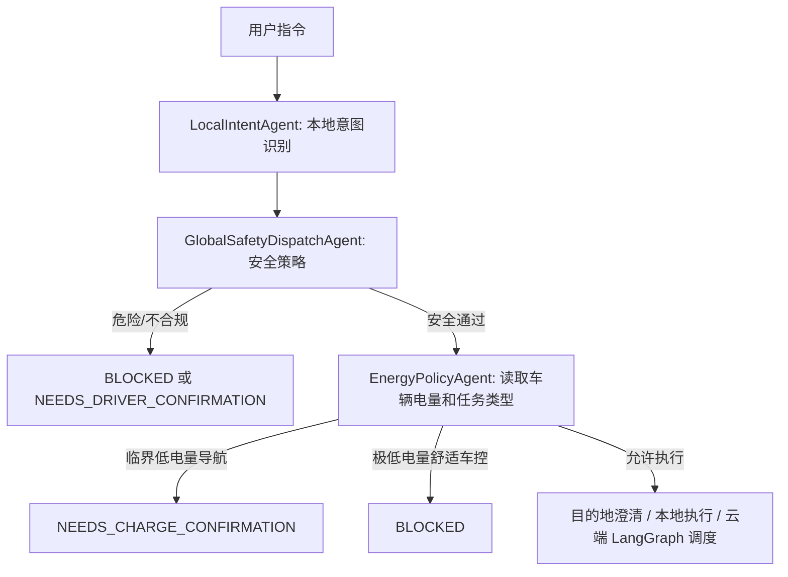

# EnergyPolicy Agent 设计说明

更新时间：2026-05-08

## 为什么要加能源策略 Agent

低电量不应该只在用户输入“电量低”时才出现。真实车载系统里，电量是车辆状态的一部分，会持续影响导航、补能、舒适性车控等任务。因此本项目把“低电量提醒”和“指令执行决策”拆成两个层次：

1. **VehicleStateMonitorAgent / VehicleEventService**：持续监控车辆状态，输出 `BATTERY_LOW`、`BATTERY_CRITICAL` 等状态事件，前端常驻展示。
2. **EnergyPolicyAgent**：在用户每次执行相关指令时读取当前车辆状态，决定是否继续执行、追加补能建议，或要求用户先确认补能方案。

## 决策规则

| 场景 | 当前处理 |
| --- | --- |
| 电量 `<= 20%` 且用户发起导航 | 允许继续导航，但在最终输出追加“建议规划补能点”的能源提示 |
| 电量 `<= 10%` 且用户发起导航 | 不直接启动普通导航，返回 `NEEDS_CHARGE_CONFIRMATION`，要求用户先确认补能规划 |
| 电量 `<= 5%` 且用户请求座椅加热等舒适性耗电功能 | 返回 `BLOCKED`，暂缓执行非必要耗电功能 |
| 电量正常 | 不干预原有指令链路 |

## 在 Agent 链路中的位置

## 面试讲法

这个 Agent 的价值不是“又多拆一个模块”，而是把车辆状态从展示数据提升为决策输入。这样系统不再只是处理自然语言，而是能把自然语言、车况、安全策略和能源策略一起建模。

面试时可以这样表达：

> 我没有把低电量做成一个普通按钮，而是做成了状态事件和执行策略两层。状态事件负责常驻提醒，EnergyPolicyAgent 负责在每条指令执行前判断低电量是否会影响这次任务。这样低电量既能主动展示，也能真正影响导航和车控决策。

