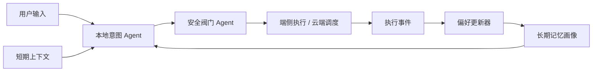

# 长期记忆与用户画像设计

本文记录当前项目中“长期记忆”的实现方式，重点说明它和本地 Agent 短期上下文的区别，以及系统在什么情况下会更新用户偏好。

## 设计目标

车载端的本地意图 Agent 需要处理单轮输入、最近上下文和车辆状态，但不应该把所有历史对话都无限塞进 prompt。因此项目把记忆拆成两类：

- 短期上下文：服务于当前会话理解，例如最近几轮用户说过什么、是否刚发生过澄清、上一次导航目的地是什么。
- 长期记忆：服务于跨会话个性化，例如用户长期偏好高速路线、常开座椅加热、关注低电量补能。

长期记忆不是聊天记录原文堆积，而是结构化画像字段。这样更接近真实车载系统：可解释、可控、可清理，也更容易做安全审查。

## 当前存储结构

长期记忆写入用户画像 JSON 中的 `long_term_memory` 字段，同时保留旧版计数字段，避免破坏已有展示和测试逻辑。

示例：

```json
{
  "route_preference_highway": 3,
  "seat_heat_auto": 2,
  "long_term_memory": {
    "route_preference": {
      "value": "高速优先",
      "confidence": 0.86,
      "source": "repeated_behavior",
      "evidence_count": 3,
      "positive_evidence_count": 3,
      "negative_evidence_count": 0,
      "evidence_type": "behavior",
      "polarity": "positive",
      "scenario": "navigation",
      "updated_at": "2026-05-11T12:30:00",
      "last_positive_at": "2026-05-11T12:30:00",
      "last_negative_at": "",
      "last_evidence": "路线偏好高速 +1"
    },
    "seat_heat_preference": {
      "value": "倾向开启座椅加热",
      "confidence": 0.7,
      "source": "repeated_behavior",
      "evidence_count": 2,
      "updated_at": "2026-05-11T12:35:00",
      "last_evidence": "座椅加热偏好 +1"
    }
  }
}
```

字段含义：

- `value`：最终可被 Agent 使用的偏好结论。
- `confidence`：置信度，综合证据类型、证据权重、正反例和边际递减后得到，最高限制为 `0.95`。
- `source`：记忆来源，目前主要是 `repeated_behavior`。
- `evidence_count`：总证据次数，等于正向证据和负向证据之和。
- `positive_evidence_count`：支持该偏好的证据次数。
- `negative_evidence_count`：反驳或削弱该偏好的证据次数。
- `evidence_type`：证据类型，例如 `behavior`、`explicit_preference`、`system_inference`。
- `polarity`：本次更新方向，`positive` 表示增强置信度，`negative` 表示降低置信度。
- `scenario`：场景标签，例如 `navigation`、`comfort`、`energy`。
- `updated_at`：最近更新时间。
- `last_positive_at`：最近一次正向证据时间。
- `last_negative_at`：最近一次负向证据时间。
- `last_evidence`：最近一次触发记忆更新的可解释描述。

## 更新规则

当前只在明确、低风险、可解释的行为中更新长期记忆：

- 用户多次导航并偏好高速路线时，更新 `route_preference = 高速优先`。
- 用户执行座椅加热相关车控时，更新 `seat_heat_preference = 倾向开启座椅加热`。
- 用户触发低电量或补能规划时，更新 `charge_awareness = 关注低电量补能提醒`。
- 用户显式表达偏好时，可以作为更高权重证据，例如“以后导航都优先走高速”。
- 用户给出反例时，可以作为负向证据降低置信度，例如“这次不要走高速”。

不会更新长期记忆的情况：

- 危险指令被拦截，例如刹车、转向、关闭 AEB、非法加速。
- 需要澄清的导航目的地，例如只说“去北京”“去大兴安岭”。
- 外部 API 失败、地图候选不稳定、置信度不足。
- `delta == 0` 的事件，即没有学习价值的等待、澄清或拦截事件。

这样做的核心原则是：长期记忆只能从稳定、重复、可解释、低风险的行为中学习，不能从一次模糊输入或危险输入中学习。

## 置信度模型

当前置信度不再只是按次数线性累加，而是采用轻量加权证据模型：

```text
confidence =
  原有置信度
  + 正向证据权重（带边际递减）
  - 负向证据权重（带边际递减）
```

证据权重来自三类信息：

- `explicit_preference`：用户显式确认，权重最高。
- `behavior`：用户重复行为，权重中等。
- `system_inference`：系统推断，权重最低。

重复行为会让置信度上升，但增长速度会逐步放缓，避免用户连续几次相似操作就把偏好置信度推满。负向证据不会删除长期记忆，而是降低 `confidence` 并增加 `negative_evidence_count`，这样系统既保留历史偏好，也能对用户近期反向表达保持敏感。

## 与短期上下文的关系

短期上下文由本地意图 Agent 使用，主要用于当前会话理解：

- 最近几轮输入。
- 压缩摘要。
- 当前车辆状态。
- 本地 RAG 召回。
- 输入重写后的规范化指令。

长期记忆由用户画像维护，主要用于跨会话个性化：

- 路线偏好。
- 舒适性偏好。
- 补能关注点。

两者的关系可以理解为：



## 与按需 RAG 的关系

长期记忆、短期上下文和 RAG 在当前项目中是三层不同能力，不能混成一个“历史知识池”：

- 长期记忆是结构化用户画像，用来表达用户长期偏好，例如路线偏好、舒适性偏好、补能关注点。
- 短期上下文是本地意图 Agent 的工作记忆，用来理解当前会话中的指代、省略和最近状态。
- 文档 RAG 是按需知识检索，用来回答“是什么、为什么、怎么做、注意事项”等说明类问题。

当前策略是：

- 普通导航、车控、补能规划默认不启用文档 RAG，只使用结构化规则、车辆状态、用户画像和必要的 Provider 结果。
- `INFO_QUERY` 或包含“是什么、为什么、怎么、如何、介绍、说明、解释、含义、手册、规则、政策、注意事项”等说明型表达时，才启用 `DocumentRAGAgent`。
- 例如“导航去蔚来中心”不会把车主手册片段塞进本地 prompt，也不会在 RAG 面板展示文档召回。
- 例如“AEB 是什么”会启用文档 RAG，因为它需要解释功能定义和安全边界。
- 文档 RAG 的召回结果属于当前任务上下文，不会直接写入长期记忆；只有稳定、重复、可解释的用户行为才会进入长期画像。

这样做可以避免两个问题：

- 避免“为了 RAG 而 RAG”，让导航、车控这类确定性任务走更稳定的规则和工具链。
- 避免文档片段污染本地小模型上下文，降低 prompt 压力，也让长期记忆保持干净。

## 面试表达口径

这个项目没有把长期记忆简单做成“历史聊天记录”，而是做成了结构化用户画像。原因是车载场景对安全、可解释和隐私更敏感：长期记忆必须能说明来源、置信度和证据次数，并且危险指令、模糊输入、失败调用都不能写入长期画像。

短期上下文解决的是“当前这句话怎么理解”，长期记忆解决的是“这个用户长期更偏好什么”。两者分层后，既能降低本地小模型 prompt 压力，又能避免历史噪声污染当前决策。

同时我把 RAG 和记忆分开：RAG 不是长期记忆，也不是每次都启用。导航、车控、补能这类任务优先走结构化规则和真实工具；只有说明类、问答类任务才启用文档 RAG。这样可以让系统既有知识增强能力，又不会把所有问题都做成关键词召回。
