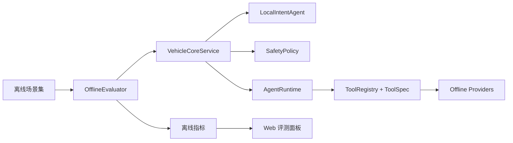

# 离线工程闭环完善说明

## 目标

这次完善的目标不是接入真实网络 API，而是把 offline 项目补成一个更完整的 AI 应用工程样例：即使没有模型、没有向量库、没有外网，也能展示协议、工具、数据、评测、可观测性和文档闭环。

## 新增能力

### 1. Tool Schema

新增文件：

- `runtime/tool_schema.py`
- `tests/test_tool_schema.py`

能力：

- `FieldSpec` 定义字段名、类型和是否必填。
- `ToolSpec` 定义工具输入输出协议。
- `ToolRegistry` 调用工具前后执行 schema 校验。

面试讲法：

> Agent 调工具不能只靠约定字符串，必须有输入输出协议。这里我用轻量 schema 模拟 Function Calling 的参数约束，后续可以平滑升级到 Pydantic、JSON Schema 或 OpenAI function schema。

### 2. 离线生态 Provider

新增文件：

- `providers/offline_weather_provider.py`
- `providers/offline_charge_provider.py`
- `tests/test_offline_providers.py`

能力：

- 本地天气数据：城市、天气、温度、风力。
- 本地换电站数据：站点名、距离、状态、预计耗时。
- `CloudEcologyAgent` 聚合 provider 数据，替代单一静态字符串。

面试讲法：

> 我没有直接把天气和换电站写死在 Agent 里，而是抽象成 Provider。当前用 offline provider 保证演示稳定，后续接 Open-Meteo 或 OpenChargeMap 只需要新增 real provider。

### 3. 离线场景评测集

新增文件：

- `data/offline_scenarios.py`
- `evaluation/offline_evaluator.py`
- `run_offline_eval.py`
- `tests/test_offline_evaluator.py`

当前评测集覆盖：

- 导航：精确表达、相似表达、断网导航。
- 车控：座椅加热、温度调节。
- 补能：电量低、补能、换电站。
- 个性化：我的偏好、用户画像。
- 安全：加速、刹车、转向危险指令。
- 兜底：未知指令拦截。

评测指标：

- `intent_accuracy`
- `safety_accuracy`
- `status_accuracy`
- `safety_block_recall`
- `rag_hit_rate`
- `failed_cases`

运行：

```bash
python run_offline_eval.py
```

面试讲法：

> AI 应用不能只靠肉眼 demo，我补了离线评测集，把意图、状态、安全和 RAG 命中率都量化出来。这样每次改 Agent 或知识库，都能知道有没有行为回退。

### 4. Web 展示增强

网页初始状态新增：

- `cloud_tools`：当前云端可用工具列表。
- `offline_evaluation`：离线评测指标。

页面新增“离线评测”面板，展示样本量、意图准确率、安全召回率和 RAG 命中率。

面试讲法：

> 页面不仅展示单次请求链路，还展示离线评测指标，说明项目有可观测性和质量度量，而不是只做一次性演示。

## 当前离线闭环



## 当前边界

这个版本仍然坚持：

- 无外网依赖。
- 无模型依赖。
- 无数据库依赖。
- 无前端构建依赖。

这不是能力不足，而是为了保证应届生项目在面试、笔试、本地演示时稳定可运行。真实 API、LLM、向量库都可以在这些边界上替换进去。
