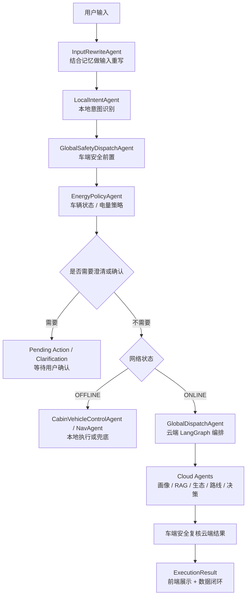

# 车载 Multi-Agent 端云协同系统综述

日期：2026-05-11

## 1. 项目定位

本项目是一个面向 AI 应用工程师岗位的车载智能座舱作品。它从最初的 offline demo 演进为一个具备端云协同、多 Agent 编排、本地小模型模拟、RAG 召回、真实 Provider 接入、安全策略、上下文管理、数据闭环和网页可观测面板的完整工程原型。

这个项目重点展示的不是“我会调用一个大模型 API”，而是：

- 如何把车载场景拆成端侧和云侧不同职责。
- 如何设计多 Agent 协作链路，而不是写一个大函数。
- 如何把 LLM、RAG、地图、天气、补能站等能力放进稳定的业务流程。
- 如何在车规场景里处理安全、确认、澄清、断网和降级。
- 如何让系统可测试、可观察、可演示、可复盘。

## 2. 总体架构

项目可以理解为三层：

```text
车载执行层
  负责本地意图识别、安全前置、车控执行、断网兜底、状态事件和本地上下文管理

端云通信 / 编排层
  通过统一 Message、ExecutionResult、Tool Registry、Runtime Trace 连接车端和云端

云端决策层
  负责用户画像、RAG 知识召回、外部生态、地图路线、补能规划和最终执行说明
```

对应的主要代码目录：

```text
agents/vehicle/       车端 Agent
agents/cloud/         云端 Agent
agents/orchestrator/  云端全局调度
core/                 统一消息、执行结果、主服务入口
workflow/             LangGraph / lightweight graph 编排
runtime/              Tool Registry、Agent Runtime、trace
providers/            地图、天气、补能、目的地解析 Provider
rag/                  本地检索增强知识库
memory/               本地 Agent 上下文、pending action、pending clarification
web_demo/             网页演示与可观测面板
tests/                单元测试、链路测试、前端逻辑测试、验收测试
```

## 3. 核心链路

一次用户指令的主流程是：



这个流程体现了一个关键设计：**LLM 和云端不是最高权限。安全、澄清和执行边界始终由车端业务策略控制。**

## 4. 八大业务 Agent 与支撑 Agent

面试时建议把系统讲成“八大业务域 Agent + 若干工程支撑 Agent”。这样既能对齐课程作业的八大 Agent，又能解释代码里为什么有更多类。

| 业务域 | 代表 Agent | 所在层 | 职责 |
| --- | --- | --- | --- |
| 意图理解 | `LocalIntentAgent` | 车端 | 本地识别 NAVIGATION、CAR_CONTROL、CHARGE_PLAN、PERSONALIZE、INFO_QUERY、UNKNOWN |
| 安全调度 | `GlobalSafetyDispatchAgent` | 车端 | 前置安全策略、危险指令拦截、云端结果复核 |
| 座舱与车控执行 | `CabinVehicleControlAgent` | 车端 | 执行温度、座椅加热等安全范围内的车控 |
| 车辆状态与能源策略 | `VehicleStateMonitorAgent` / `EnergyPolicyAgent` | 车端 | 监控车速、电量、道路类型，触发低电量提醒和补能确认 |
| 用户画像 | `UserProfileAgent` | 云端 | 读取长期偏好，如温度、座椅加热、路线偏好 |
| 知识检索 | `RuleKnowledgeAgent` / `DocumentRAGAgent` | 云端 | 规则库处理确定性策略；文档 RAG 从 `rag/corpus/*.md` 加载车主手册、服务政策、功能说明等长文本知识 |
| 外部生态 | `ExternalEcologyAgent` / `RouteProviderAgent` | 云端 | 获取天气、补能站、地理编码、地图路线 |
| 出行规划与决策 | `GlobalTripPlanningAgent` / `CloudDecisionAgent` | 云端 | 生成路线方案和最终执行说明 |

支撑 Agent / 模块包括：

- `InputRewriteAgent`：结合短期记忆把“去老地方”这类表达重写成更明确的指令。
- `DestinationConfidenceAgent`：目的地置信度判断，避免低置信度地点直接导航。
- `DestinationClarification`：当用户只说“去北京”“去上海最漂亮的地方”时，进入澄清状态。
- `DataUploadAgent`：记录执行事件和偏好变化，形成数据闭环。
- `AgentRuntime` / `ToolRegistry`：统一工具调用、输入输出记录和耗时 trace。

## 5. 云端 LangGraph 编排

云端默认启用 LangGraph；如果环境中不可用，会回退到内置 lightweight graph。这样项目既能展示真实图编排思想，也能保持 offline 可运行。

当前导航类任务的云端路径是：

```text
context_parallel -> provider_parallel -> trip_plan -> decision -> assemble
```

含义：

- `context_parallel`：并行收集用户画像、知识库召回、路线偏好。
- `provider_parallel`：并行获取外部生态和路线工具结果。
- `trip_plan`：统一生成路线方案。
- `decision`：生成最终执行说明。
- `assemble`：组装结果和可观测信息。

为什么这样设计：

- 用户画像、RAG、路线偏好相互独立，可以并行。
- 天气 / 补能站和地理编码 / 地图路线都是外部 IO，可以并行。
- 最终路线方案必须等所有上下文返回后再生成，不能提前让 LLM 猜。

## 6. RAG 与目的地置信度

项目里 RAG 不只是“把关键词搜出来拼给模型”，而是逐步收敛成可控的召回层：

- 意图识别有本地知识库和规则引擎。
- 云端知识库用于补充路线、补能、安全和用户画像信息。
- RAG 召回结果会展示在前端，方便解释为什么系统这么判断。
- 对目的地采用澄清策略：模糊输入不直接执行。

导航类输入的处理逻辑：

```text
明确目的地 / 常用高置信地点 -> 可执行
城市级、泛地点、低置信 POI -> NEEDS_CLARIFICATION
候选地点多个但不确定 -> 返回候选，等待用户确认
GPS 坐标 -> 直接作为显式目的地
```

这个设计的面试重点是：**导航系统不能为了“看起来智能”而把低置信地点直接发给地图执行。**

## 7. 本地小模型与上下文管理

项目把 DeepSeek 低级模型模拟为车端离线小参数 LLM，主要服务于：

- 本地意图 Agent 的语义兜底。
- 输入重写 Agent 的上下文补全。
- 安全解释和云端结果复核。

本地上下文管理只针对单个 Agent，作用域是：

```text
agent_id + user_id + session_id
```

上下文包包括：

- 压缩摘要 `summary`
- 最近窗口 `recent_turns`
- 用户偏好 `preference_state`
- 车辆状态 `vehicle_state`
- RAG 召回 `retrieved_context`
- prompt 预算信息 `window`

为了模拟车端小模型上下文有限的问题，系统会：

- 只保留最近若干轮语义有效对话。
- 将旧对话压缩成摘要。
- 过滤 `UNKNOWN`、`BLOCKED` 这类不适合作为长期语义记忆的内容。
- 控制 prompt token 和输出长度。

## 8. 安全策略

车载 AI 和普通聊天应用最大的不同是安全优先级。

本项目安全链路包括：

- 原始输入和重写输入都要安全检查，防止重写绕过危险词。
- 动力、制动、转向、AEB 等高风险指令走安全策略。
- 高速和城市道路下同一句“加速到100km/h”处理不同：高速可进入驾驶员确认，城市超限直接拦截。
- 云端返回结果也要经过车端安全复核，避免云端 LLM 生成危险执行建议。

这体现了项目里的一个核心原则：

**车端安全策略是硬边界，LLM 只能解释和辅助，不能越权放行。**

## 9. Provider 接入

项目用 Provider 抽象隔离真实 API 和离线模拟：

| 能力 | 真实 Provider | 离线 Provider |
| --- | --- | --- |
| 云端 LLM | DeepSeek | Mock LLM |
| 本地小模型模拟 | DeepSeek / local provider | Mock local |
| 地图路线 | 高德地图 / 百度地图 | OfflineMapProvider |
| 地理编码 | 高德地理编码 | 内置常用地点 / 失败澄清 |
| POI / 补能站 | 高德 POI / OpenChargeMap | OfflineChargeProvider |
| 天气 | Open-Meteo | OfflineWeatherProvider |

工程价值：

- 面试演示可连接真实接口。
- 无网络或无 key 时仍可 offline 跑通。
- 业务层不直接依赖第三方 API 格式，后续替换 Provider 成本低。

## 10. Web 演示面板

网页不只是“能跑”，而是项目的可观测面板。核心展示：

- 车辆状态：车速、电量、道路、限速、辅助驾驶模式。
- 指令执行：用户画像、演示按钮、输入框、运行按钮。
- 执行结果：意图、安全等级、执行状态、Markdown 渲染结果。
- Agent 调用链：每个 Agent 的职责、端云标签、对应工具输出。
- RAG 召回知识：展示本次召回依据。
- 路线与补能：地图路线距离、耗时、策略、补能站。
- 本地意图 Agent 上下文：展示本地小模型上下文窗口、摘要和 prompt 预览。
- Provider 状态：展示当前接入的是 DeepSeek、高德、Open-Meteo 还是离线 Provider。
- 验收报告：展示当前测试和 QA 状态。

这个前端对面试很重要，因为它能让面试官直观看到“Agent 调了谁、为什么这么判断、外部接口有没有真的参与”。

## 11. 测试与验收

项目测试覆盖了：

- 统一消息协议
- 意图识别
- 安全策略
- 输入重写
- 本地上下文管理
- 目的地澄清
- 能源策略
- LangGraph 编排
- Provider 工厂和真实 Provider 客户端
- Runtime trace
- Web API 和前端渲染逻辑

验收报告中曾记录：

```text
unit tests: PASS
offline evaluation: PASS
Web QA: PASS
```

最近一次并行链路改造后，针对 LangGraph、runtime trace、Web model 和前端逻辑的回归验证结果为：

```text
69 passed, 2 warnings
```

## 12. 面试讲法

可以用下面这段作为开场：

> 这个项目是一个车载 Multi-Agent 端云协同系统。我把它拆成车端执行层、端云编排层和云端决策层。车端负责本地意图识别、安全前置、车辆状态和断网兜底；云端负责用户画像、RAG 召回、外部生态、地图路线和最终决策。中间通过统一 Message、Tool Registry 和 Runtime Trace 连接。  
> 
> 项目不是简单地把所有问题都丢给 LLM，而是把 LLM 放在受控的业务链路里：意图识别可以用本地小模型兜底，云端 DeepSeek 负责复杂路线说明，但安全、澄清、确认和执行权限都由规则和车端 Agent 控制。  
> 
> 后续我又针对真实工程问题做了多轮增强，比如目的地低置信度不直接导航、低电量由状态事件触发、云端工具并行化、前端 trace 对齐 Agent 输出、本地小模型上下文压缩等。这些改动让项目从 demo 更接近一个可解释、可测试、可扩展的 AI 应用工程作品。

## 13. 推荐演示顺序

面试演示建议按这个顺序讲：

1. 在线导航端云协同：展示完整链路和真实地图 / 天气 / 补能数据。
2. 模糊目的地澄清：证明系统不会低置信导航。
3. 高速速度请求确认：证明安全策略结合车辆上下文。
4. 城市超限危险拦截：证明安全前置。
5. 低电量能源策略：证明状态事件不依赖用户主动输入。
6. 本地上下文面板：证明车端小模型有上下文预算和压缩管理。
7. Agent 调用链：解释端云 Agent 分工、并行组和工具输出。
