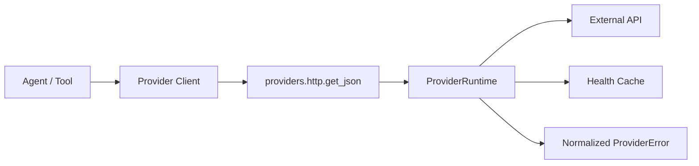

# Provider Runtime 容错链路

本项目已经把外部接口调用收敛到统一 Provider Runtime。它解决的问题是：真实地图、天气、补能、LLM 等接口不可避免会出现超时、限流、5xx、返回结构异常，如果每个 Provider 自己处理错误，系统会很快变成“哪里都能失败，但哪里都说不清楚”。

## 链路结构

## Runtime 能力

`providers/runtime.py` 提供：

- `ProviderRuntimeConfig`：统一配置 timeout、retry、backoff、circuit breaker。
- `ProviderRuntime`：统一记录 Provider 调用状态。
- `ProviderHealthSnapshot`：记录 provider、operation、状态、失败次数、最近错误码和最近延迟。
- circuit breaker：连续 retryable 失败达到阈值后，短时间内直接阻断请求，避免继续打爆外部接口。

## 错误模型

`providers/errors.py` 统一了错误类型：

- `ProviderTimeoutError`
- `ProviderUnavailableError`
- `ProviderCircuitOpenError`
- `ProviderBadResponseError`

这些错误都能输出稳定 payload：

- `provider`
- `operation`
- `code`
- `retryable`
- `user_message`
- `technical_detail`
- `details`

前端和 Agent 不再直接面对 `urllib`、HTTPError、JSONDecodeError 这类底层异常。

## 配置项

通过 `.env` 配置：

- `PROVIDER_TIMEOUT_SECONDS`
- `PROVIDER_RETRIES`
- `PROVIDER_BACKOFF_SECONDS`
- `PROVIDER_CIRCUIT_FAILURE_THRESHOLD`
- `PROVIDER_CIRCUIT_RESET_SECONDS`
- `PROVIDER_HEALTH_TTL_SECONDS`

这些配置统一由 `config/settings.py` 读取，Provider 工厂会把 timeout 注入真实 Provider，HTTP 层会读取 retry/backoff/circuit 设置。

## 当前接入范围

已接入统一 HTTP Runtime 的 Provider：

- AMap Route
- AMap Geocode
- AMap POI
- Baidu Map
- Open-Meteo Weather
- OpenChargeMap

离线 Provider 不走该链路，因为它们不访问外部网络。

## 面试表述

可以这样介绍：

> 我把外部 API 调用统一封装成 Provider Runtime，提供 timeout、retry、backoff、circuit breaker 和 health cache。地图、天气、补能等 Provider 不再各自处理网络异常，而是统一归一化成 `ProviderError`。这样前端和 Agent 看到的是稳定错误协议，系统也能在连续失败时自动熔断，避免在线链路长时间阻塞。
