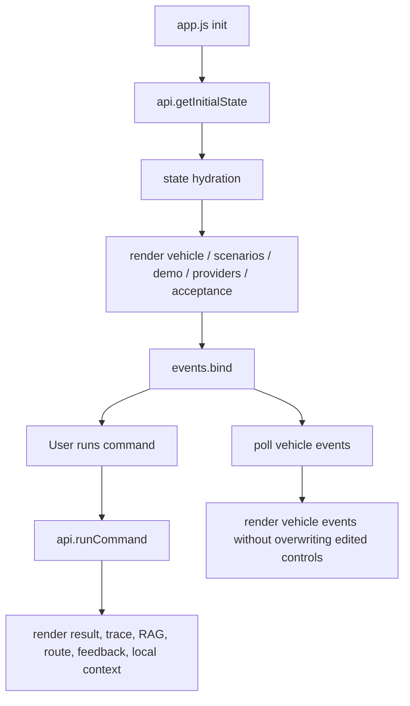

# Web Frontend Modularization Design

Date: 2026-05-08

## Goal

Refactor the Web demo frontend from one large `web_demo/static/app.js` file into small, purpose-specific modules while keeping the visible UI, API contract, and demo behavior unchanged.

The current frontend is useful for demonstration, but `app.js` has grown to about 900 lines and mixes API calls, state management, event binding, result rendering, Markdown rendering, vehicle-state polling, Provider panels, and demo-step rendering. The next step should improve maintainability without changing the product surface.

## Non-Goals

- Do not redesign the UI.
- Do not change backend API routes.
- Do not introduce a frontend framework or build step.
- Do not change existing demo scenarios, result semantics, or Agent behavior.
- Do not add new product features during this refactor.

## Recommended Approach

Use native ES modules with multiple files under `web_demo/static/js/`. This keeps the project dependency-free and easy to run with the existing Python server.

Alternative approaches considered:

1. **Keep one file and only clean sections**
   - Lowest risk, but does not solve the growing-file problem.
2. **Introduce Vite/React**
   - Better long-term frontend ergonomics, but too heavy for an offline-friendly interview demo.
3. **Native ES module split**
   - Best fit now: no build step, low migration risk, clear engineering improvement.

## Target File Layout

```text
web_demo/static/
  app.js                    # thin entrypoint, imports modules
  js/
    api.js                  # fetch wrappers and response parsing
    state.js                # shared frontend state
    dom.js                  # DOM node lookup
    events.js               # event binding and command orchestration
    markdown.js             # Markdown to safe HTML rendering
    renderers/
      vehicle.js            # vehicle panel and automatic state events
      demo.js               # demo steps and scenario buttons
      result.js             # execution result, clarification, badges
      trace.js              # Agent trace, LangGraph path, runtime trace
      rag.js                # RAG context panel
      feedback.js           # data feedback panel
      providers.js          # Provider status and smoke test panel
      acceptance.js         # acceptance report panel
      route.js              # route and charging station panel
      local-context.js      # local LLM context panel
```

## Module Responsibilities

### `api.js`

Owns all browser-to-backend calls:

- `getInitialState()`
- `runCommand(payload)`
- `updateVehicleState(payload)`
- `getVehicleEvents()`
- `runProviderSmokeTest()`
- `getAcceptance()`

It also owns `parseJsonResponse()` so error handling stays consistent.

### `state.js`

Stores the small shared UI state:

- selected network
- selected user id
- scenarios
- demo steps
- active demo id
- request sequence and latest active request id

This file should not touch the DOM directly.

### `dom.js`

Creates one `nodes` object for all DOM references. If an element is missing, the failure should be obvious during initialization.

### `events.js`

Owns user interactions and command orchestration:

- bind Online/Offline buttons
- bind run button and Enter key
- bind vehicle-state update button
- start vehicle event polling
- prevent stale command responses from overwriting newer results

### Renderers

Each renderer owns one panel or one rendering concern. Renderers receive data and DOM nodes; they should avoid calling backend APIs directly except where a panel action naturally owns the action, such as Provider smoke test.

## Data Flow



## Error Handling

The existing smart error behavior should be preserved:

- Provider or API failures render a user-readable title and message.
- Technical details remain visible in a small section.
- Runtime trace should show `ProviderError`.
- Route and RAG panels should clear when no valid result exists.

No errors should be converted into silent offline fallback in online mode.

## Testing Strategy

Preserve and extend current frontend logic tests:

- Verify `app.js` is now a thin module entrypoint.
- Verify `api.js` contains all expected API endpoints.
- Verify result rendering still handles:
  - `NEEDS_CLARIFICATION`
  - `NEEDS_DRIVER_CONFIRMATION`
  - `NEEDS_CHARGE_CONFIRMATION`
  - `BLOCKED`
  - `EXECUTED`
- Verify vehicle polling still calls `renderVehicle(..., { syncControls: false, syncNetwork: false })`.
- Run full backend test suite after refactor.
- Restart Web server and smoke test:
  - normal online navigation
  - fuzzy destination clarification
  - critical battery navigation confirmation
  - extremely low battery comfort-control block

## Migration Plan

1. Add `web_demo/static/js/` modules with copied functions from `app.js`.
2. Convert `app.js` into a thin entrypoint.
3. Update `web_demo/static/index.html` to load `app.js` as `type="module"`.
4. Run frontend logic tests and fix import/export issues.
5. Run full test suite.
6. Restart local Web demo on `http://127.0.0.1:8031/`.
7. Smoke test critical demo flows.

## Acceptance Criteria

- Existing UI looks and behaves the same.
- No backend API contract changes.
- No new runtime dependency or build command is required.
- Full test suite passes.
- Local Web demo starts successfully on `8031`.
- `app.js` becomes an entrypoint rather than the main implementation file.
- Each major panel has a clear renderer module.

## Risks and Mitigations

- **Risk: ES modules fail to load because script type is missing.**
  - Mitigation: update `index.html` to use `type="module"` and smoke test in browser.
- **Risk: circular imports between renderers and events.**
  - Mitigation: keep `state`, `nodes`, and API calls as explicit parameters or small shared imports.
- **Risk: stale response guard breaks during extraction.**
  - Mitigation: keep request sequence logic in `events.js` and add/retain tests around stale command handling.
- **Risk: text encoding issues in existing Chinese strings.**
  - Mitigation: move code mechanically first, avoid rewriting display strings unless required by tests.

## Self-Review

- No placeholder requirements remain.
- Scope is limited to frontend modularization.
- Design does not require new dependencies.
- Backend behavior remains unchanged.
- Testing and smoke-test criteria are explicit.

