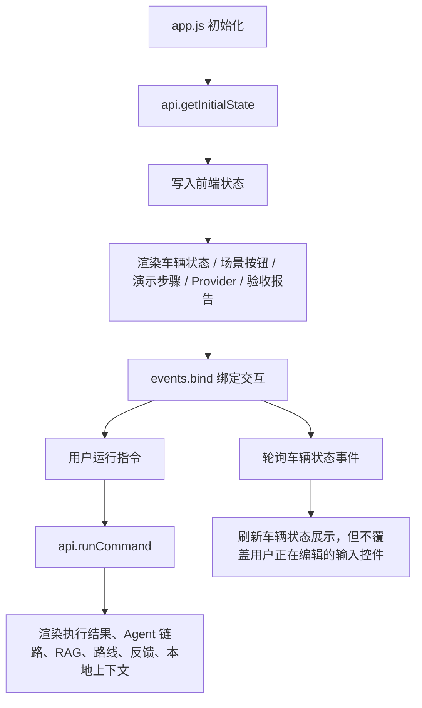

# Web 前端模块拆分设计

日期：2026-05-08

## 目标

将当前 Web 演示前端从一个大型 `web_demo/static/app.js` 文件拆分为多个职责清晰的小模块，同时保持现有页面 UI、后端 API 契约和演示行为不变。

当前前端已经能完整展示车载 Multi-Agent 端云协同系统，但 `app.js` 已经增长到约 900 行，混合了承担 API 请求、状态管理、事件绑定、执行结果渲染、Markdown 渲染、车辆状态轮询、Provider 面板、演示步骤渲染等职责。下一步应优先提升可维护性，而不是继续堆功能。

## 非目标

- 不重新设计 UI。
- 不修改后端 API 路由。
- 不引入 React、Vue、Vite 等前端框架或构建步骤。
- 不改变现有演示场景、执行语义或 Agent 行为。
- 不在本次重构中新增产品功能。

## 推荐方案

采用原生 ES Modules，将前端拆分到 `web_demo/static/js/` 目录下。这样可以保持项目无前端构建依赖，继续由当前 Python Web 服务直接运行。

对比过的方案：

1. **继续保留单文件，只做局部清理**
   - 风险最低，但不能真正解决文件过大、职责混杂的问题。
2. **引入 Vite / React**
   - 长期前端开发体验更好，但对当前离线友好、面试演示型项目来说过重。
3. **原生 ES Modules 拆分**
   - 当前最合适：无构建步骤、迁移风险低，同时能明显体现工程化能力。

## 目标文件结构

```text
web_demo/static/
  app.js                    # 轻量入口文件，只负责初始化
  js/
    api.js                  # 后端接口请求与响应解析
    state.js                # 前端共享状态
    dom.js                  # DOM 节点查询
    events.js               # 事件绑定与指令执行编排
    markdown.js             # Markdown 安全渲染
    renderers/
      vehicle.js            # 车辆状态面板与自动状态事件
      demo.js               # 演示步骤与场景按钮
      result.js             # 执行结果、澄清卡片、状态徽标
      trace.js              # Agent 调用链、LangGraph 路径、runtime trace
      rag.js                # RAG 召回面板
      feedback.js           # 数据闭环面板
      providers.js          # Provider 状态与 Smoke Test
      acceptance.js         # 验收报告面板
      route.js              # 路线与补能面板
      local-context.js      # 本地 LLM 上下文面板
```

## 模块职责

### `api.js`

统一封装浏览器到后端的请求：

- `getInitialState()`
- `runCommand(payload)`
- `updateVehicleState(payload)`
- `getVehicleEvents()`
- `runProviderSmokeTest()`
- `getAcceptance()`

同时保留 `parseJsonResponse()`，确保错误处理逻辑一致。

### `state.js`

维护少量前端共享状态：

- 当前网络状态
- 当前用户 ID
- 场景按钮数据
- 演示步骤数据
- 当前激活的演示步骤
- 请求序号与当前最新请求 ID

这个模块不直接操作 DOM。

### `dom.js`

集中创建 `nodes` 对象，统一管理页面中所有 DOM 节点引用。如果页面元素缺失，应在初始化阶段尽早暴露问题。

### `events.js`

负责用户交互和指令执行编排：

- 绑定 Online / Offline 按钮
- 绑定运行指令按钮和 Enter 快捷键
- 绑定车辆状态更新按钮
- 启动车辆状态事件轮询
- 维护请求序号，避免旧请求返回后覆盖新结果

### `renderers/*`

每个 renderer 只负责一个面板或一种展示逻辑。原则上 renderer 接收数据并更新 DOM，不主动调用后端接口。少数面板自带动作时可以例外，例如 Provider Smoke Test。

## 数据流



## 错误处理

保留现有智能错误展示逻辑：

- Provider 或 API 调用失败时，前端展示用户可理解的标题和原因。
- 技术细节保留在小字说明中，便于调试。
- Runtime trace 中显示 `ProviderError`。
- 没有有效结果时，路线面板和 RAG 面板应清空或显示空状态。

在线模式下，外部服务失败不应静默切换为离线兜底。

## 测试策略

保留并扩展当前前端逻辑测试：

- 验证 `app.js` 已变成轻量入口。
- 验证 `api.js` 包含所有核心接口调用。
- 验证结果渲染仍支持以下状态：
  - `NEEDS_CLARIFICATION`
  - `NEEDS_DRIVER_CONFIRMATION`
  - `NEEDS_CHARGE_CONFIRMATION`
  - `BLOCKED`
  - `EXECUTED`
- 验证车辆状态轮询仍调用 `renderVehicle(..., { syncControls: false, syncNetwork: false })`，避免覆盖用户正在编辑的车辆状态输入。
- 重构后运行全量测试。
- 重启 Web 服务后做冒烟测试：
  - 正常在线导航
  - 模糊目的地澄清
  - 临界低电量导航补能确认
  - 极低电量座椅加热拦截

## 迁移计划

1. 新建 `web_demo/static/js/` 模块目录。
2. 将 `app.js` 中的函数按职责迁移到对应模块。
3. 将 `app.js` 改为轻量入口文件。
4. 修改 `web_demo/static/index.html`，使用 `type="module"` 加载 `app.js`。
5. 运行前端逻辑测试，修复 import/export 问题。
6. 运行全量测试。
7. 重启本地 Web 演示服务 `http://127.0.0.1:8031/`。
8. 对关键演示链路做接口和页面冒烟测试。

## 验收标准

- 页面视觉和交互行为保持不变。
- 后端 API 契约不变。
- 不新增运行依赖和构建命令。
- 全量测试通过。
- 本地 Web 演示能在 `8031` 正常启动。
- `app.js` 只保留初始化入口职责。
- 主要面板都有独立 renderer 模块。

## 风险与规避

- **风险：ES Modules 加载失败。**
  - 规避：更新 `index.html` 为 `type="module"`，并在浏览器中做实际冒烟测试。
- **风险：模块之间出现循环依赖。**
  - 规避：将 `state`、`nodes`、API 调用保持为清晰的显式依赖，避免 renderer 之间互相调用。
- **风险：旧请求覆盖新请求的保护逻辑在迁移中被破坏。**
  - 规避：保留请求序号逻辑，并补充测试覆盖。
- **风险：现有中文字符串存在编码历史问题，迁移时误改导致测试不稳定。**
  - 规避：第一轮以机械拆分为主，尽量不重写展示文案；需要修中文时单独处理。

## 自检

- 没有遗留 TBD / TODO。
- 范围聚焦在前端模块拆分。
- 不引入新依赖。
- 不改变后端行为。
- 测试与冒烟验收标准明确。

